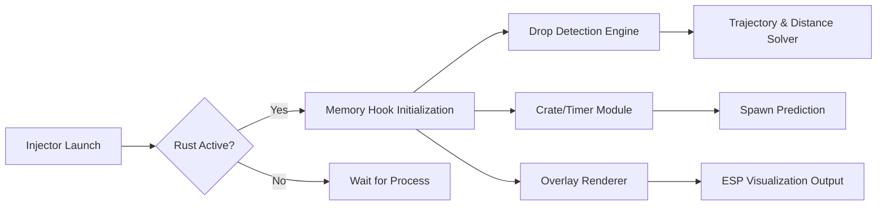

## 🌐 Overview

**Rust Drop ESP Advanced Visual Tracking Software** is a specialized overlay suite tailored for players who value information as their sharpest weapon. It highlights **airdrops**, **elite crates**, **Bradley/Military loot points**, and **high-value map objects**, giving you the tactical advantage of **early interception**, **route prediction**, and **safe approach planning**.

Unlike general-purpose ESP tools, this system focuses on **precision loot intelligence**—clean visuals, tunable overlays, and near-zero frame cost.

[!NOTE]
Modules are fully configurable: opacity, distance thresholds, filters, and map markers adapt to your playstyle.

---
## 👁 Feature Highlights (Focused on Drop Intelligence)

### 🎯 Drop & Crate ESP

* **Airdrop Box Highlighting** with distance and descent timer
* **Helicopter Crate Indicators**
* **Bradley APC Crate Visualization**
* **Oil Rig Elite Crate Tracker**
* **Timed Respawn Projections** for monuments

### 🗺 Route & Distance Tools

* Dynamic **safe path suggestions**
* **Line-to-drop tracing** with customizable thickness
* Display loot **trajectory arcs** for descending drops

### 🌌 Supplemental ESP Suite

* Player proximity outlines
* NPC scientists/animals (optional)
* Vehicle/travel point marking (horses, cars, minis)
* Tool cupboard & sleeping bag detection (off by default)

### 🎞 Overlay Modes

* **Minimal Glow** for stealthy, low-clutter play
* **Full Tactical Mode** with crates + players + monument timing
* **Color-coded rarity** shading

---

## 🧰 Compatibility

| Category            | Support | Notes                        |
| ------------------- | ------- | ---------------------------- |
| Rust (Steam)        | ✔️      | Auto-offset detection        |
| Rust Staging Branch | ✔️      | Experimental stability       |
| DirectX 11          | ✔️      | Optimal overlay clarity      |
| Low-End PCs         | ✔️      | Supports Performance Mode    |
| Multi-Monitor       | ✔️      | Overlay binds to Rust window |

---

## ⚡ Setup Instructions

A setup gentle as stringing a bow, yet precise as splitting arrows.

### **1. Extract the Software**

Place the folder in a writable directory away from system paths:
`D:\RustTools\DropESP\`

### **2. Run the Injector**

Inside the folder, open a terminal:

```bash
rust_dropesp.exe --inject rust_client --overlay
```

### **3. Configure Drop Tracking**

Open:

`/configs/drops/default.json`

```json
{
  "airdrops": {
    "enabled": true,
    "max_distance": 2000,
    "color": "cyan",
    "show_timer": true
  },
  "heli_crates": {
    "enabled": true,
    "color": "orange",
    "pulse": true
  },
  "elite_crates": {
    "enabled": true,
    "opacity": 0.85
  }
}
```

### **4. Hotkeys**

| Action              | Default Key    |
| ------------------- | -------------- |
| Toggle Drop ESP     | F5             |
| Cycle Overlay Modes | F7             |
| Reload Config       | CTRL + ALT + R |
| Panic Mode          | DEL            |

### **5. Test in a Controlled Session**

Visit Airfield, Trainyard, or Oil Rig to confirm crate highlighting.

---

## 🧭 System Logic (Mermaid Diagram)



A graceful circuit—each module reinforcing the next.
---

## 🌌 Advanced Modules

### **Airdrop Trajectory Predictor**

Projects the landing zone based on real-time descent velocity and wind direction (game-calculated).

### **Monument Respawn Clocks**

Oil Rig / Launch Site / Military Tunnel crate timers displayed on HUD.

### **Silent Heatmaps**

Shows where recent drops landed across the last 30 minutes—excellent for ambush routing.

### **Stealth ESP Mode**

Minimalist, barely visible edges for subtle competitive play.

### **Distance-Weighted Color Fading**

Crates further than 1 km shift to pale blue; closer ones glow warmer—intuitive distance sensing without reading numbers.

---
## 🔧 Example Preset Collections

### **1. Solo Ambush Hunter**

A style for quiet stalkers in forests and ridgelines:

* Airdrop ESP: 1500m
* Elite Crates: On
* Players: Minimal outlines only
* Overlay: Stealth Mode
* Path Tracing: Disabled

### **2. Scrap Runner / Duo Build**

For fast movement and decisive looting:

* Airdrop ESP: 2500m
* Timers: On
* Helis/Bradley Crates: Bright Pulse
* Path Tracing: Enabled

### **3. Oil Rig Dominator**

Designed for rig control sessions:

* Elite Crates: Full highlight
* Scientists: On (red)
* Timer display: On
* Player ESP: Enhanced skeleton outlines
---

## ❓ FAQ

### **Does the ESP reduce FPS?**

Usually less than a 2% performance impact. Enable *Performance Mode* if needed.

### **Are crate timers accurate?**

They track internal respawn cycles and are synchronized on each detection event.

### **Can I customize ESP colors?**

Yes—RGB, HEX, opacity, pulse effects, and thickness values.

### **Does it work on community modded servers?**

Most, though some custom plugins alter crate spawn timings.

### **What if overlays disappear after alt-tabbing?**

Use the “Overlay Rebind” hotkey: `CTRL + ALT + R`.

### **Can I share presets?**

Absolutely—config `.json` files can be exported/imported.

---
## 🌅 Final Thoughts

Rust is a symphony of risk—one airdrop can crown you with glory or send you into the maw of roaming hunters.
This **Rust Drop ESP** software bends the chaos just enough to whisper direction, to tint the world with legible signals, to guide you through storms of gunfire and opportunity.

Not overpowering—merely illuminating.
Not loud—merely wise.

For those who thrive on anticipation, timing, and perfect positioning, this tool becomes a trusted cartographer of the unknown.

---
