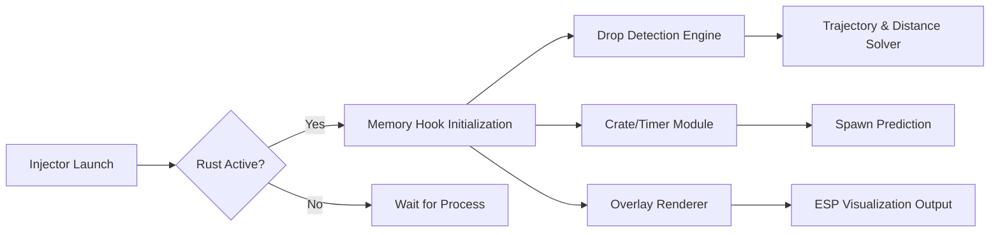

## 🌐 Overview

**Rust Drop ESP Advanced Visual Tracking Software** is a specialized overlay suite tailored for players who value information as their sharpest weapon. It highlights **airdrops**, **elite crates**, **Bradley/Military loot points**, and **high-value map objects**, giving you the tactical advantage of **early interception**, **route prediction**, and **safe approach planning**.

Unlike general-purpose ESP tools, this system focuses on **precision loot intelligence**—clean visuals, tunable overlays, and near-zero frame cost.

[!NOTE]
Modules are fully configurable: opacity, distance thresholds, filters, and map markers adapt to your playstyle.

---
## 👁 Feature Highlights (Focused on Drop Intelligence)

### 🎯 Drop & Crate ESP

* **Airdrop Box Highlighting** with distance and descent timer
* **Helicopter Crate Indicators**
* **Bradley APC Crate Visualization**
* **Oil Rig Elite Crate Tracker**
* **Timed Respawn Projections** for monuments

### 🗺 Route & Distance Tools

* Dynamic **safe path suggestions**
* **Line-to-drop tracing** with customizable thickness
* Display loot **trajectory arcs** for descending drops

### 🌌 Supplemental ESP Suite

* Player proximity outlines
* NPC scientists/animals (optional)
* Vehicle/travel point marking (horses, cars, minis)
* Tool cupboard & sleeping bag detection (off by default)

### 🎞 Overlay Modes

* **Minimal Glow** for stealthy, low-clutter play
* **Full Tactical Mode** with crates + players + monument timing
* **Color-coded rarity** shading

---

## 🧰 Compatibility

| Category            | Support | Notes                        |
| ------------------- | ------- | ---------------------------- |
| Rust (Steam)        | ✔️      | Auto-offset detection        |
| Rust Staging Branch | ✔️      | Experimental stability       |
| DirectX 11          | ✔️      | Optimal overlay clarity      |
| Low-End PCs         | ✔️      | Supports Performance Mode    |
| Multi-Monitor       | ✔️      | Overlay binds to Rust window |

---

## ⚡ Setup Instructions

A setup gentle as stringing a bow, yet precise as splitting arrows.

### **1. Extract the Software**

Place the folder in a writable directory away from system paths:
`D:\RustTools\DropESP\`

### **2. Run the Injector**

Inside the folder, open a terminal:

```bash
rust_dropesp.exe --inject rust_client --overlay
```

### **3. Configure Drop Tracking**

Open:

`/configs/drops/default.json`

```json
{
  "airdrops": {
    "enabled": true,
    "max_distance": 2000,
    "color": "cyan",
    "show_timer": true
  },
  "heli_crates": {
    "enabled": true,
    "color": "orange",
    "pulse": true
  },
  "elite_crates": {
    "enabled": true,
    "opacity": 0.85
  }
}
```

### **4. Hotkeys**

| Action              | Default Key    |
| ------------------- | -------------- |
| Toggle Drop ESP     | F5             |
| Cycle Overlay Modes | F7             |
| Reload Config       | CTRL + ALT + R |
| Panic Mode          | DEL            |

### **5. Test in a Controlled Session**

Visit Airfield, Trainyard, or Oil Rig to confirm crate highlighting.

---

## 🧭 System Logic (Mermaid Diagram)



A graceful circuit—each module reinforcing the next.
